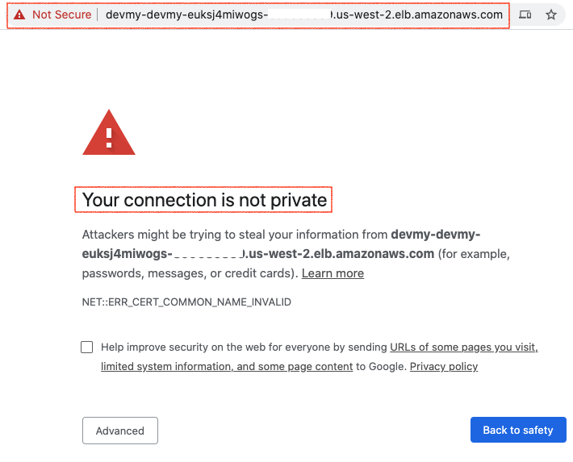

# Section 4: Using AWS Certificate Manager (ACM) to deploy SSL/TLS certificates

# Objective

In the getting started sections 01 and 02, we can access our Laravel application through HTTP connection but not HTTPS. Security and privacy are important and high priority to think about. We are going to have [AWS Certificate Manager](https://aws.amazon.com/certificate-manager/) (ACM)'s help to deploy SSL/TLS certificates and make HTTPS connection happen. AWS Certificate Manager removes the time-consuming manual process of purchasing, uploading, and renewing SSL/TLS certificates.

# Highlights

- Using [AWS Certificate Manager](https://aws.amazon.com/certificate-manager/) (ACM) to create, deploy and manage SSL/TLS certificates.
- [Terminate](https://en.wikipedia.org/wiki/TLS_termination_proxy) SSL/TLS connection at the ALB.
- Point our sub domain name (CNAME) to the ALB.

# Architecture Overview


# Workshop

- Step 4.1: Duplicate files from workshop into your project repo
- Step 4.2: Modify environment variables
- Step 4.3: Deployment

## Prerequisite

- Section 1 or 2: make sure you have published docker image into your ECR.
- Section 3: have a project repo.
- A domain name you can manage. (e.g adding a new CNAME record for it.)

## Step 4.1: Duplicate files from workshop into your project repo

First of all, please clean up the folders and files except your `src` folder in your project repo. Please refer to [Step 3.4](../section-03/).

Duplicate files from workshop section 4 folder:

```
# Make sure you are at workshop base folder
❯ pwd
/xxx/xxx/xxx/laravel-on-aws-ecs-workshops

❯ cd section-04

# If your project repo path is different than the folder design in [Section 3](../section-03/), please modify the path below.
❯ cp -r * ../../my-laravel-on-ecs
❯ cp -r .* ../../my-laravel-on-ecs

# Switch to your project repo
❯ cd ../../my-laravel-on-ecs
```

## Step 4.2: Modify environment variables

```
# Make sure you are at your project repo folder (NOT the workshop folder)
❯ pwd
/xxx/xxx/xxx/my-laravel-on-ecs

# Switch to the CDK folder of your project repo
> cd cdk

# If you have duplicated this file, you can skip this step
> cp export-variables.example export-variables
```

Edit the file `my-laravel-on-ecs/cdk/export-variables` and modify the value of `THIS_DEPLOYMENT_DOMAINNAME` to be the domain name in your case. For example, in my case will be `export THIS_DEPLOYMENT_DOMAINNAME="ernestchiang.com"`.

```
> source export-variables
```

## Step 4.3: Deployment

Now, it's time to bootstrap the cdk:

```
> cdk bootstrap
 ⏳  Bootstrapping environment aws://111111111111/us-west-2...
CDKToolkit: creating CloudFormation changeset...
[██████████████████████████████████████████████████████████] (3/3)

 ✅  Environment aws://111111111111/us-west-2 bootstrapped.
```

Synth:

```
> cdk synth
```

Now, it's time to deploy :)

```
> cdk deploy

# follow the instruction on the CLI, usually need to press `y`.

...
...

```

When you see something like this and seem pending there, it's time to login your AWS Management Console > ACM to setup a CNAME record for your domain. Once you add the CNAME record, wait for couple minutes, the CDK script will continue if it detects the CNAME configuration is correct.

```
2:54:23 PM | CREATE_IN_PROGRESS   | AWS::CertificateManager::Certificate        | DevMyLaravelCert
```

The result of setting up the CNAME record is showing `Issued` status in the ACM Certificates list. (The domain name and additional names will match to yours. The screenshot below is an example.)


```
...
...


Outputs:
DevMyLaravelLaravelOnAwsWorkshopStack.DevMyLaravelActionCname = Please setup a CNAME record mylaravel.your_domain_name_here.com to DevMy-DevMy-11AOKXxxxxxxx-1234567890.us-west-2.elb.amazonaws.com
DevMyLaravelLaravelOnAwsWorkshopStack.DevMyLaravelActionVisit = Visit https://mylaravel.your_domain_name_here.com
DevMyLaravelLaravelOnAwsWorkshopStack.DevMyLaravelAlbDnsName = DevMy-DevMy-11AOKXxxxxxxx-1234567890.us-west-2.elb.amazonaws.com
```

Now you can test in your browser by visiting `https://DevMy-DevMy-11AOKXxxxxxxx-1234567890.us-west-2.elb.amazonaws.com/`. Before seeing the Laravel homepage, you will find the browser says that **Your connection is not private**:



The reason is we (ACM) signed the certificate with our own domain name and assigned the signed certificate into our load balancer listener. Let's go to manage our domain name and add one new CNAME `mylaravel.your_domain_name_here.com` and the value is the AlbDnsName `DevMy-DevMy-11AOKXxxxxxxx-1234567890.us-west-2.elb.amazonaws.com` generated by CDK.

For example, the screenshot below is adding the CNAME on my domain:


Then we can visit the CNAME to check it out at `https://mylaravel.your_domain_name_here.com`, and you will see it shows **Connection is secure** now :)


Great job! We are ready to start [Section 5](../section-05/) :)

### Learning Station

Using ACM to generate a **certificate (cert)** and place into the **listener** of our **application load balancer (alb)**. The ALB listener will terminate SSL/TLS and convert to HTTP protocol to assigned **target group** which points to our Laravel application.

```javascript

    //---------------------------------------------------------------------------
    // Cert
    const domainAlternativeName = '*.' + deploymentEnv.domainName;
    const cert = new acm.Certificate(this, generateName('Cert'), {
      domainName: deploymentEnv.domainName,
      subjectAlternativeNames: [domainAlternativeName],
      validation: acm.CertificateValidation.fromDns(), // Records must be added manually
    });

    //---------------------------------------------------------------------------
    // ALB
    const alb = new elbv2.ApplicationLoadBalancer(this, generateName('ALB'), {
      vpc,
      internetFacing: true,
    });

    const listener = alb.addListener('Listener', {
      open: true,
      certificates: [cert],
      protocol: elbv2.ApplicationProtocol.HTTPS,
    });

    // Connect ecsService to TargetGroup
    const targetGroup = listener.addTargets(generateName('LaravelTargetGroup'), {
      protocol: elbv2.ApplicationProtocol.HTTP,
      targets: [ecsService]
    });

```

# Reference

- [SSL/TLS termination proxy](https://en.wikipedia.org/wiki/TLS_termination_proxy)
- [CDK aws-elasticloadbalancingv2 module overview](https://docs.aws.amazon.com/cdk/api/latest/docs/aws-elasticloadbalancingv2-readme.html)